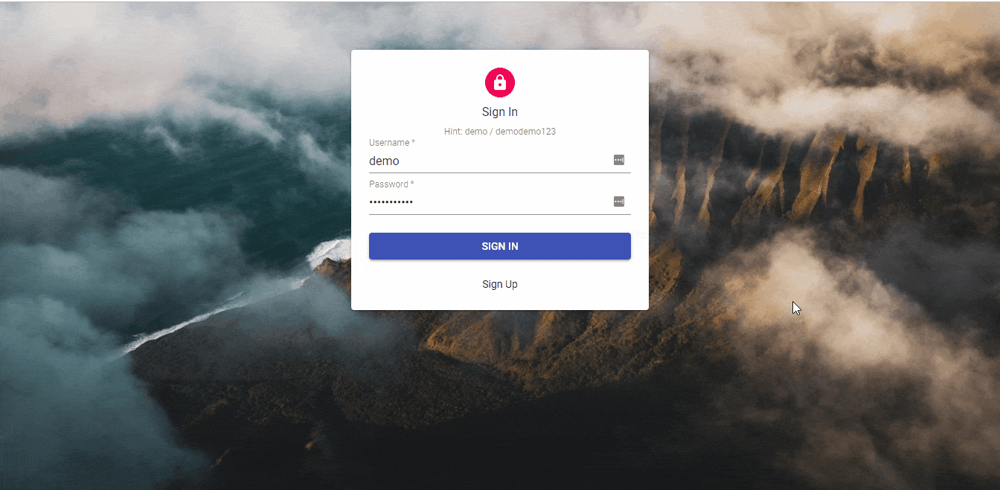

# Income and Expense Manager

An application that visualizes incomes and expenses information

# Demo



# Demo on Heroku

https://expenseincomemanager.herokuapp.com

## Getting Started

These instructions will get you a copy of the project up and running on your local machine for development and testing purposes. See deployment for notes on how to deploy the project on a live system.

### Prerequisites

You will need to have

- python 3 installed, you can download python via https://www.python.org/downloads/
- node.js installed, you can install node.js via https://nodejs.org/en/
- pipenv installed, you can install it after installing python 3 with

```
$ pip install pipenv
```

### Installing

Install dependencies for server

```
$ pipenv install
```

Install dependencies for client

```
$ npm install
```

### Environment Variables

You will need to create environment variables for the following values:

- EXPENSE_INCOME_APP_SECRET_KEY (a string that represents the secret key for django app)
- EXPENSE_INCOME_APP_DEBUG (set to "TRUE" on local machine)

The ways of configuring the environment variables vary between different operating systems. You can refer to the following YouTube videos for further information (by Corey Schafer)

- Mac & Linux: https://www.youtube.com/watch?v=5iWhQWVXosU
- Windows: https://www.youtube.com/watch?v=IolxqkL7cD8

### Running the application locally

Running the server

```
$ pipenv shell
$ python manage.py migrate
$ python manage.py runserver
### server runs on localhost:8000
```

Runnng the client (open another terminal to run the client)

```
$ pipenv shell
$ npm run dev
### The JavaScript bundle file will be compiled, you can visit in by visiting localhost:8000 (same port)
```

## Deploy on Heroku

1. Make sure you have a Heroku account, you can register an account at https://www.heroku.com/
2. Make sure you have the Heroku CLI installed, you can install it via https://devcenter.heroku.com/articles/heroku-cli
3. Download the project as zip or clone the project with git clone
   ```
   $ git clone https://github.com/williamang2736/expense-income-manager.git
   ```
4. Login with heroku
   ```
   $ login heroku
   ```
5. Go to the heroku web dashboard, press on 'New' -> 'Create new app'
6. Enter your application name and submit
7. Setup environment variables by going to 'Settings' -> 'Reveal config vars' -> provide the environment variable values.
   - EXPENSE_INCOME_APP_SECRET_KEY (a string that represents the secret key for django app)
   - EXPENSE_INCOME_APP_DEBUG (set to "FALSE" on heroku config vars)
8. Add heroku as a remote repository
   ```
    $ git init
    $ heroku git:remote -a <your-heroku-application-name>
   ```
9. Add heroku postgresql addon
   ```
   $ heroku addons:create heroku-postgresql:hobby-dev
   ```
10. Build production version of React app
    ```
    $ npm run build
    ```
11. Add files for commit
    ```
    $ git commit -am "commit message"
    ```
12. Push to heroku (deploy)
    ```
    $ git push heroku master
    ```
13. Run migration command to populate tables
    ```
    $ heroku run python manage.py migrate
    ```
14. Verify the app is working
    ```
    $ heroku open
    ```

## Built With

- [Django](https://github.com/django/django) - Python web framework
- [Django Rest Framework](https://github.com/encode/django-rest-framework) - Django Rest Framework
- [React](https://github.com/facebook/react) - Front end library
- [React Admin](https://github.com/marmelab/react-admin) - Admin User Interface
- Please refer to package.json file for more information

## License

This project is licensed under the MIT License - see the [LICENSE.md](LICENSE.md) file for details
